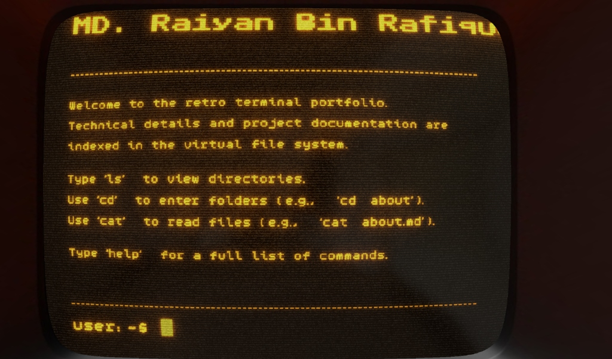
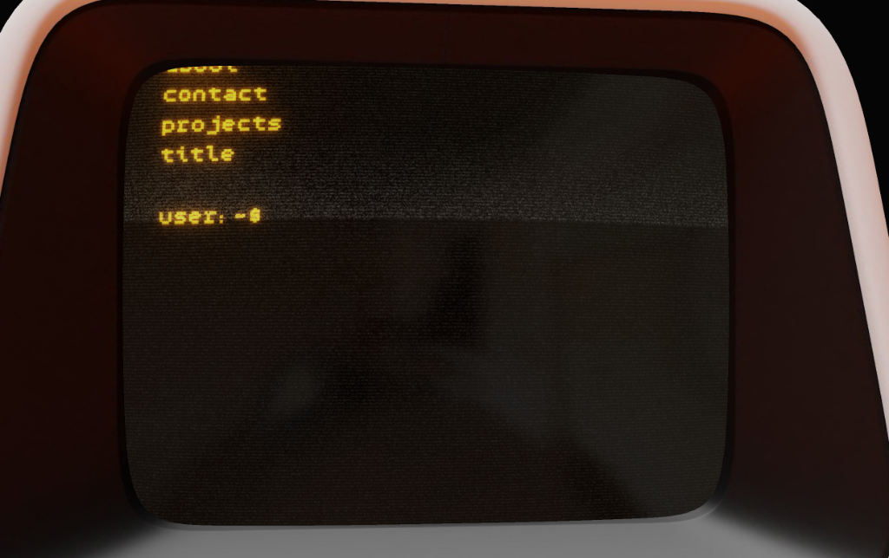
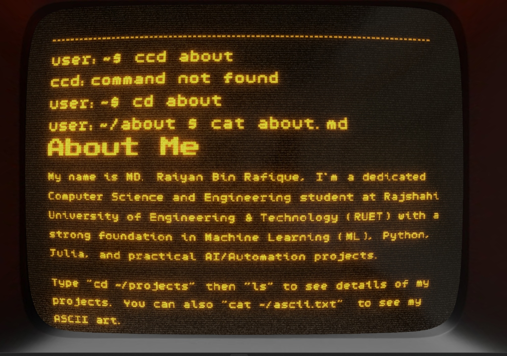

# 📟 Retro Terminal Portfolio — MD. Raiyan Bin Rafique

> A fully immersive, 3D-rendered **Commodore PET 8296-style** terminal portfolio. Built from scratch with Three.js and a custom WebGL text engine — no canvas 2D, no HTML overlays. Everything you see on that screen is rendered in real-time WebGL.

---

## 🖥️ Live Demo

🔗 **[hodini007.github.io/portfolio](https://hodini007.github.io/portfolio/)**

---

## 📸 Screenshots

### Boot Screen


### `ls` — Exploring the File System


### `cat about.md` — Reading Portfolio Files


---

## ✨ What Is This?

This is my personal portfolio — presented as a **functional retro terminal** running inside a 3D-rendered vintage computer. Instead of a conventional website with cards and carousels, visitors interact with a simulated Bash-like shell to explore my resume, projects, and contact details.

You type commands. The terminal responds. Everything is rendered live in WebGL.

---

## 🕹️ Terminal Commands

| Command | Description |
|---|---|
| `ls` | List directories/files in current folder |
| `cd <dir>` | Change directory (e.g. `cd projects`) |
| `cat <file>` | Render a markdown file (e.g. `cat about.md`) |
| `pwd` | Print current working directory |
| `help` | Show all available commands |
| `clear` | Clear the terminal screen |

### 📁 Portfolio File System

```
/home/user/
├── about/          → About Me
├── education/      → Academic history
├── skills/         → Technical skills & tools
├── projects/       → AI, ML & Physics projects
├── certifications/ → Harvard CS50x, AI credentials
└── contact/        → Email & GitHub links
```

---

## 🛠️ Tech Stack

| Layer | Technology |
|---|---|
| **3D Rendering** | [Three.js](https://threejs.org/) (WebGL) |
| **Language** | TypeScript |
| **Bundler** | Vite |
| **Text Engine** | Custom WebGL glyph renderer (no canvas 2D) |
| **Post-Processing** | UnrealBloom, custom CRT noise & lag shaders (GLSL) |
| **Fonts** | Public Pixel, Chill (bitmap retro typefaces) |
| **Styling** | Vanilla CSS |
| **3D Model** | Commodore PET 8296 (custom baked GLTF) |

---

## 🏗️ Architecture

```
src/
├── terminal/
│   ├── index.ts          # Keyboard input, Enter/Arrow handling
│   ├── bash.ts           # Command parsing & routing
│   ├── fileSystemBash.ts # Virtual FS traversal
│   └── applications/
│       ├── ls.ts         # List directory contents
│       ├── cd.ts         # Change directory
│       ├── show.ts       # Render markdown files (cat alias)
│       └── pwd.ts        # Print working directory
├── webgl/
│   ├── screen/
│   │   ├── textEngine.ts     # Custom WebGL text renderer + scroll engine
│   │   ├── renderEngine.ts   # Bloom, CRT shader, lag buffer
│   │   └── lag.ts            # Intentional CRT phosphor lag effect
│   └── shaders/
│       ├── noise.frag        # CRT scanline + noise shader
│       └── vertex.vert
└── file-system/
    └── home/user/            # Resume content as Markdown files
```

---

## ⚙️ What We Built & Fixed

This project went through several rounds of deep technical refinement:

### ✅ Custom WebGL Text Engine
- Built a character-by-character glyph renderer using `TextGeometry` merged into a single draw call per frame
- Implemented word-wrap, multi-font support (h1/h2/h3/p), and inline markdown rendering
- Designed a scroll system tracking `totalContentHeight` vs. `logicalScreenHeight` for accurate scroll bounds

### ✅ Terminal Interaction Layer
- Full keyboard input pipeline: character insertion, deletion, caret navigation via Arrow keys
- On `Enter`: `freezeInput()` bakes typed characters into the static text mesh, clears the dynamic `inputBuffer`, and resets coordinate state for the next prompt
- `scrollToEnd()` called after every command so the new prompt is always visible

### ✅ Bug Fixes
| Bug | Fix |
|---|---|
| Ghost text ("ls" overlapping output) | `rootGroup.remove(c)` instead of `sceneRTT.remove(c)` — characters live in `rootGroup` |
| Output colliding with command | `placeMarkdown()` now always calls `placeLinebreak()` before rendering |
| Caret invisible after command | `yBefore` captured before linebreak so full height is tracked in `totalContentHeight` |
| Arrow Down couldn't reach prompt | Fixed `maxScroll = totalContentHeight - logicalScreenHeight` calculation |
| Caret drifting right | `charNextLoc.x = 0` reset in both `freezeInput()` and `placeText()` |

---

## 🚀 Getting Started

```bash
# Install dependencies
npm install

# Run dev server
npm run dev

# Build for production
npm run build
```

---

## 📬 Contact

- **Email**: [raiyanrohit10@gmail.com](mailto:raiyanrohit10@gmail.com)
- **GitHub**: [github.com/hodini007](https://github.com/hodini007)

---

*Developed & Designed by **MD. Raiyan Bin Rafique** — CSE @ RUET*
